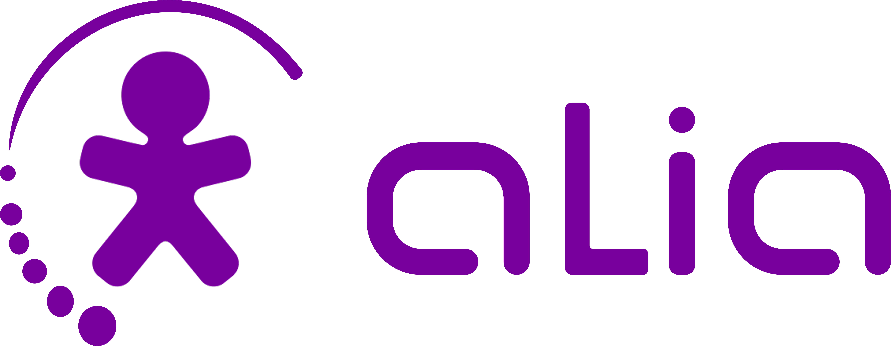
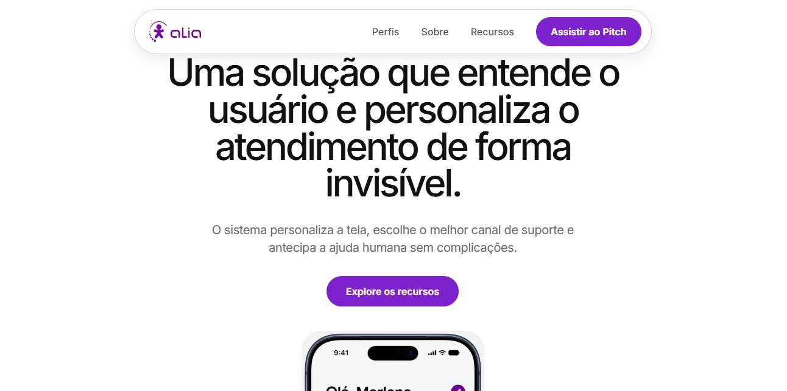

  

 

  

# Modo Alia

### Olimpíada de Dados Vivo

Uma proposta de interface simplificada para o aplicativo Vivo, desenvolvida para pessoas idosas, pessoas com baixo letramento digital e usuários que enfrentam dificuldades com interfaces convencionais.

O **Modo Alia** reduz a complexidade da interface, priorizando clareza, acessibilidade e facilidade de uso.

## Sobre

O Modo Alia transforma a experiência do aplicativo Vivo por meio de:

* Botões maiores e mais claros
* Ícones fáceis de identificar
* Menos informações por tela
* Navegação simplificada
* Linguagem objetiva
* Maior acessibilidade visual

A proposta é permitir que funcionalidades essenciais sejam encontradas e utilizadas com menos esforço.

## Tecnologias

  
  &nbsp;&nbsp;&nbsp;
  
  &nbsp;&nbsp;&nbsp;
  

  HTML5 &nbsp;·&nbsp; CSS3 &nbsp;·&nbsp; JavaScript

## Transmídia

O projeto também possui conteúdos que apresentam o **Modo Alia** em diferentes formatos.

### Instagram

Acompanhe nossas transmissões, conteúdos e posts sobre o projeto.

  

  <a href="COLOQUE-AQUI-O-LINK-DO-INSTAGRAM">
    Instagram do Modo Alia
  </a>

## Video Pitch

  

  <a href="COLOQUE-AQUI-O-LINK-DO-VIDEO">
    Assistir ao Video Pitch
  </a>

## Objetivo

Criar uma experiência digital mais simples, acessível e inclusiva, demonstrando como uma interface alternativa pode facilitar o acesso às principais funcionalidades do aplicativo Vivo.

> Tecnologia deve ser simples para todos.

## Equipe

**Agno Souza**,
**Bruno Guerra**,
**Marina Yumi** e
**Giovanna Cintra**

**Etec de Taboão da Serra**

Orientadora: **Alicia Stefanny**

## Entrega

**31 de agosto de 2026**

Projeto desenvolvido para a **Olimpíada de Dados da Vivo**.
